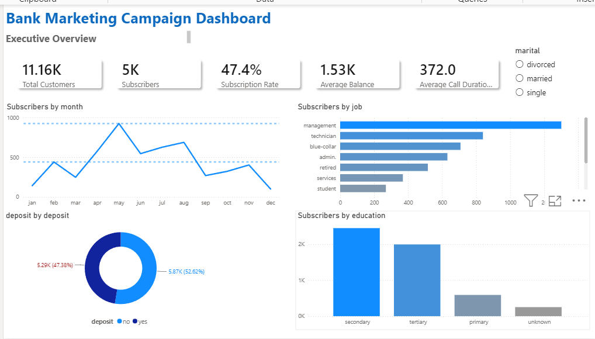
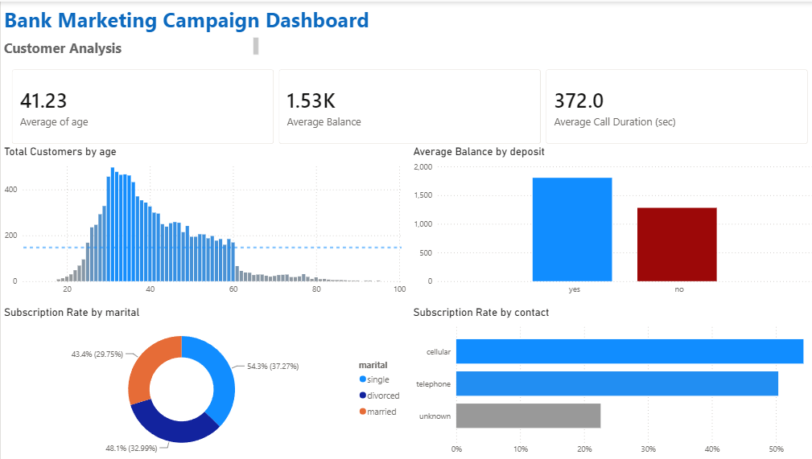
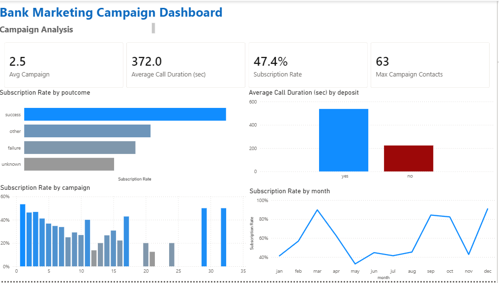

# 📊 Bank Marketing Analysis

## 📌 Project Overview

This project delivers an end-to-end data analytics and machine learning solution for a bank marketing campaign. The workflow covers data cleaning, preprocessing, exploratory data analysis (EDA), feature engineering, predictive modeling, model evaluation, and interactive dashboard development using Power BI.

The project analyzes customer demographics, financial information, and previous marketing campaign data to identify the key factors influencing term deposit subscriptions. Multiple classification models were trained and compared using several evaluation metrics to select the best-performing model. Finally, business insights and recommendations were presented through an interactive Power BI dashboard to support data-driven marketing decisions.

---

## 🎯 Business Objective

The main objective of this project is to:

- Analyze customer data from a bank marketing campaign.
- Understand customer characteristics and campaign performance.
- Identify the factors that influence subscription to term deposits.
- Build predictive machine learning models.
- Support business decisions using data visualization.

---

## 📂 Dataset

The project uses the **Bank Marketing Dataset**, which contains customer demographic information, previous marketing campaign details, and subscription outcomes.

The dataset includes information such as:

- Age
- Job
- Marital Status
- Education
- Balance
- Housing Loan
- Personal Loan
- Contact Type
- Campaign Information
- Previous Campaign Outcome
- Subscription (Target Variable)

---

## 🛠️ Tools & Technologies

- Python
- Pandas
- NumPy
- Matplotlib
- Seaborn
- Scikit-learn
- Microsoft Excel
- Power BI
- Jupyter Notebook

---

## 🔄 Project Workflow

- Data Understanding and Business Problem Definition
- Data Quality Assessment
- Data Cleaning and Preprocessing
- Exploratory Data Analysis (EDA)
- Feature Engineering and Encoding
- Data Visualization
- Machine Learning Model Development
- Model Evaluation and Comparison
- Interactive Power BI Dashboard Development
- Business Insights and Recommendations

---
## ✅ Key Project Tasks

- Assessed data quality by checking missing values, duplicates, inconsistent categories, and outliers.
- Cleaned and preprocessed customer data for analysis and machine learning.
- Performed Exploratory Data Analysis (EDA) to identify customer behavior patterns and campaign trends.
- Engineered and encoded features for predictive modeling.
- Built and compared multiple classification models, including Logistic Regression, Decision Tree and Random Forest
- Evaluated model performance using Accuracy, Precision, Recall, F1-score, and ROC-AUC.
- Designed a three-page interactive Power BI dashboard for executive reporting, customer analysis, and campaign performance.
- Generated business recommendations to improve marketing efficiency and customer targeting.

## 🤖 Machine Learning Models

The following classification models were implemented and evaluated:

- Logistic Regression
- Decision Tree
- Random Forest
- Support Vector Machine (SVM)


Evaluation metrics:

- Accuracy
- Precision
- Recall
- F1-score
- Confusion Matrix

---

## 📈 Power BI Dashboard

The Power BI dashboard provides interactive insights into:

- Customer Demographics
- Campaign Performance
- Subscription Distribution
- Customer Segmentation
- Marketing KPIs

---
## 📊 Dashboard Preview

### Overview


### Customer Analysis


### Campaign Analysis


## 📊 Key Insights

Some important findings include:
- Previous campaign success was one of the strongest indicators of future customer subscriptions.
- Longer call durations were associated with higher subscription rates.
- Cellular communication outperformed telephone contact in campaign effectiveness.
- Customers contacted fewer times showed better conversion rates.
- Customer occupation, education level, and account balance significantly influenced subscription decisions.
- The best-performing machine learning model improved customer targeting by reducing prediction errors and
  supporting more effective marketing strategies. 


---

## 📁 Repository Structure

```
bank-marketing-analysis
│
├── data
│   ├── bank.csv
│   └── data_description.pdf
│
├── notebook
│   └── final_project.ipynb
│
├── dashboard
│   └── final_project_power.pbix
│
├── report
│   └── final_project_report.docx
│
├── media
│   └── project_demo.mp4
│
└── README.md
```


## 👨‍💻 Author

**Fady Makram**

- Computer Science Graduate
- Aspiring Data Analyst / Data Scientist

GitHub: https://github.com/FadyM128

LinkedIn: https://www.linkedin.com/in/fady-makram-044a39240
